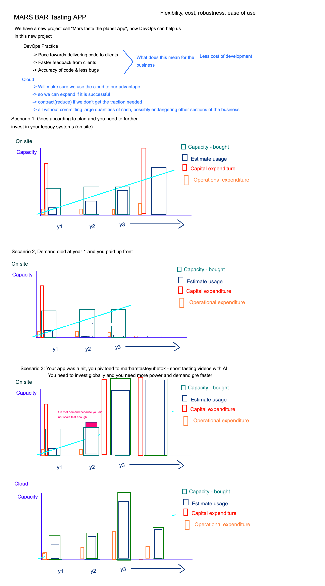

# AWS & Cloud   

- Cloud is typically cheaper now but companies will choose on-prem for other reasons, mainly security concerns
- In the past, cloud posed security concerns, but now even governments are switching to private clouds, the UK government has invested  in G-cloud for government business
- HOWEVER, if you are a really successful and large business, it is preferable to purchase on site servers 

## AWS - Creating EC2 instance
- Location -> **Ireland**
- EC2 -> Launch Instance
  
### Step 1: Choose and Amazon Machine Image (AMI)
- Ensure free tier only
- Ubuntu 18.04

### Step 2: Choose Instance type
- Size of machine 
  - Leave as is -> Free tier eligable

### Step 3: Configure Instance Details
- **Network:** DevOpsStudents
- **Subnet:** euwest-1b
- **Enable** Auto-assign Public IP

### Step 4: Add Storage
- Leave as is

### Step 5: Tags
- Add Name -> eng74-matt-app-server

### Step 6: Security Group
- eng74.matt.SG.home
  - HTTP -> Port 80 -> My IP
  - SSH -> Port 22 -> My IP
  - Custom -> Port 3000 -> My IP

### Step 7: Review and Launch
- Use my own AWS key pair generated into the ~/.ssh folder -> eng74mattawskey.pem

## To access VM
`ssh -i eng74mattawskey.pem ubuntu@<Public IP of Instance on AWS>`

## SCP and RSYNC
- Secure copy protocol (SCP) is a means of securely transferring computer files between a local host and a remote host or between two remote hosts. It is based on the Secure Shell (SSH) protocol. **USED IN WINDOWS**
- RSYNC also copies files locally or over a network. But it employs a special delta transfer algorithm and a few optimizations to make the operation a lot faster. Consider the call. - **USED IN UNIX**

## Sending in Data to VM i.e. SCP
- Open 