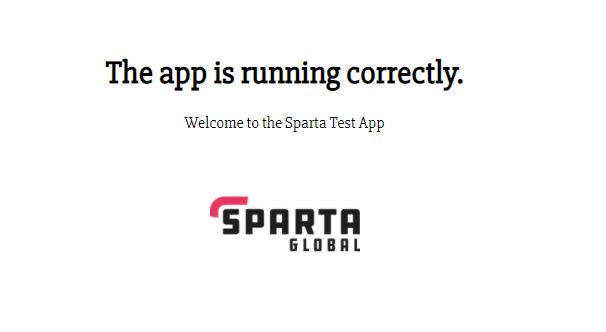

# Setting up a CICD piplines using Jenkins and AWS on the Node App
## Requirements
- Git Bash
- AWS EC2 instances
- Cloned this repository
  
## EC2 Instances
- This is the machine where the App will be hosted and can be connected to via SSH in terminal
**1.** Both the App and DB can be set up on 1 AWS instance, simply launch an instance of Ubuntu 18.04 with free tier.
**2.** Choose the free tier instance type
**3.** Configure the instance:
   - Network -> DevOps students
   - Subnet -> euwest 1b
   - Auto-assign Public IP -> Enable
**4.** Add Storage -> Leave as is
**5.** Add Tags -> Name - eng74-matt-app/db-instance
**6.** Configure Security Group
   - One of the most important options, can add ports such as 3000, 80, 22, 8080 etc which are essential in order for the application to work
**7.** Review -> Make sure all of the options have been selected as described

## CI & CD with Jenkins
First of, we need to set up a CI pipeline where Jenkins connects to the github repo with all of the necessary files and tests them. In a working environment, there would normally be several branches on a given Repository, this CI will listen to the `dev-env` branch and when code is pushed to this branch, Jenkins will first test the code to ensure all tests pass before merging to main

**Jenkins CI**
1. New Item -> app_ci 
2. FREESTYLE PROJECT
3. **Configurations**
   1. **General**   
      - Description of project
      - Discard Old Builds -> Max 2 Builds
      - Github project -> Repo URL
   2. **Office 365 Connector**
      - Restrict where this project can be run -> sparta-ubuntu-node (An instance to run test)
   3. **Source Code Management**
      - Git -> Repository URL -> branches to build `*/dev-env`
      - Credentials -> SSH key generated to connect to PC
   4. **Build Triggers**
      - Github hook trigger for GITScm polling
   5. **Build Environment**
      - Provide Node & npm bin/ folder to PATH
      - NodeJS Installation
   6. **Build**
      - Click Add build step -> Execute Shell `cd app/ npm install npm test
   7. **Post-Build Actions**
      - Git Publisher -> Push only if build succeeds -> merge results
      - Branch to push -> main
      - Target remote nam -> origin

**Ensure there is a webhook to your Github**
- Go to Github repo -> Settings -> Webhooks -> Add item -> URL of Jenkins/github-webhook/
- Content type -> prefer json
- Add webhook
- Now anything pushes to this repo will be detected by jenkins and job will run

### To test CI -> Add something to readme and push to dev-env branch of click Build Now in Jenkins
- Build will be successful if the orb turns blue

**Jenkins CD**
- Now that everything has been tested on localhost, we can set up a job which will automatically push the successful changes to AWS server i.e. DEPLOY CODE
1. New Item -> app_ci_deploy
1. FREESTYLE PROJECT
2. **Configurations**
   1. **General**   
      - Description of project
      - Discard Old Builds -> Max 2 Builds
      - Github project -> Repo URL
   2. **Office 365 Connector**
      - Restrict where this project can be run -> sparta-ubuntu-node (An instance to run test)
   3. **Source Code Management**
      - Git -> Repository URL -> branches to build `*/main`
      - Credentials -> SSH key generated to connect to PC
   4. **Build Triggers**
      - Build after other projects are built
        - Projects to watch -> app_ci -> Trigger only if build is stable
      - Github hook trigger for GITScm polling
   5. **Build Environment**
      - Use secret texts or files
        - SSH User Private key -> AWS Access key created in AWS
          - Storing that key in a key file variable to use in commands later
      - Provide Node & npm bin/ folder to PATH
   6. **Build**
      - Click Add build step -> Execute Shell:
`scp -o "StrictHostKeyChecking=no" -i $AWS_ACCESS -r app/ ubuntu@54.229.27.155:~/`
`scp -o "StrictHostKeyChecking=no" -i $AWS_ACCESS -r environment/ ubuntu@54.229.27.155:~/` 
`ssh -o "StrictHostKeyChecking=no" -i $AWS_ACCESS ubuntu@54.229.27.155<<EOF`
`sudo pm2 kill` 
`chmod +x /environment/app/provision.sh` 
`./environment/app/provision.sh # Reruning the provision file EOF`

### Now the CD is setup so that it listens to the app_ci job and will only trigger if successfully built (i.e all tests pass and pushed to main). The commands essentially copy the app/ and environment/ folders into the AWS instance, enters the machine, and run the provision.sh file in order to start the app. Now app can be accessed by typing the public IP of the instance.

